<p align="center">
  
</p>

<h1 align="center">🍽️ E-Waiter — Restaurant Order Management</h1>

<p align="center">
  <strong>A full-stack MERN application that digitizes the entire restaurant workflow,<br/>
  connecting customers, chefs, waiters, and admins through real-time communication.</strong>
</p>

<p align="center">
  
  
  
  
  
  
  
</p>

<p align="center">
  
  
  
</p>

---

## � Screenshots

### 🪑 Customer (Table View)

<details>
<summary><strong>🍔 Menu & Cart</strong></summary>
<br/>

| Menu — Browse & Filter by Category | Cart — Review & Place Order |
|:---:|:---:|
| 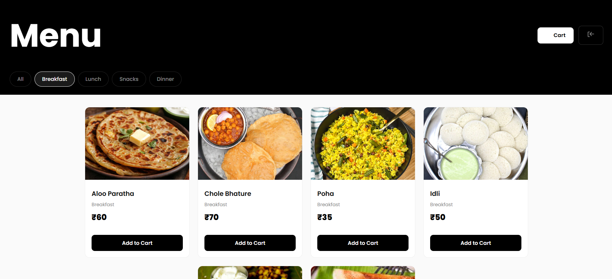 | 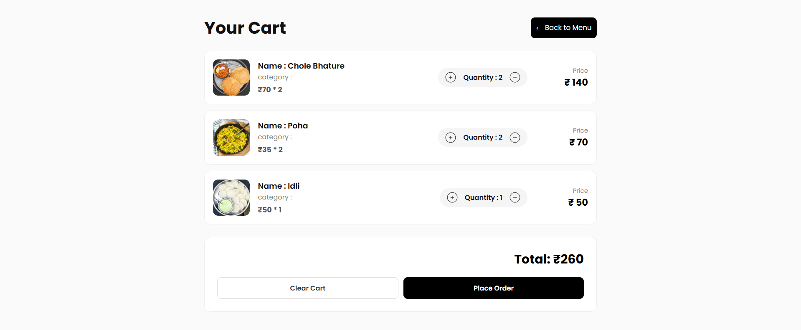 |

</details>

---

### 👨‍🍳 Chef (Kitchen View)

<details>
<summary><strong>🔥 Live Order Tickets</strong></summary>
<br/>

| Kitchen Orders | Order Details |
|:---:|:---:|
| 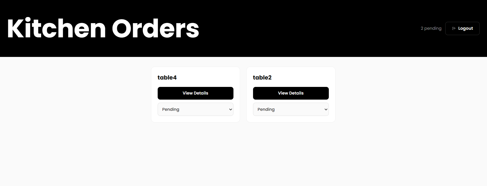 | 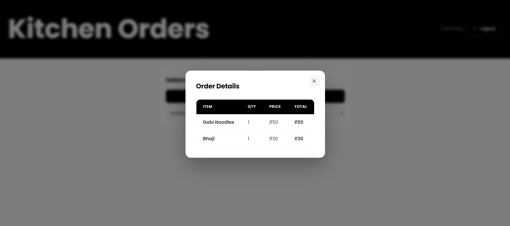 |

</details>

---

### 🍽️ Waiter (Delivery View)

<details>
<summary><strong>🚀 Delivery Management</strong></summary>
<br/>

| Deliveries Queue | Delivery Details |
|:---:|:---:|
| 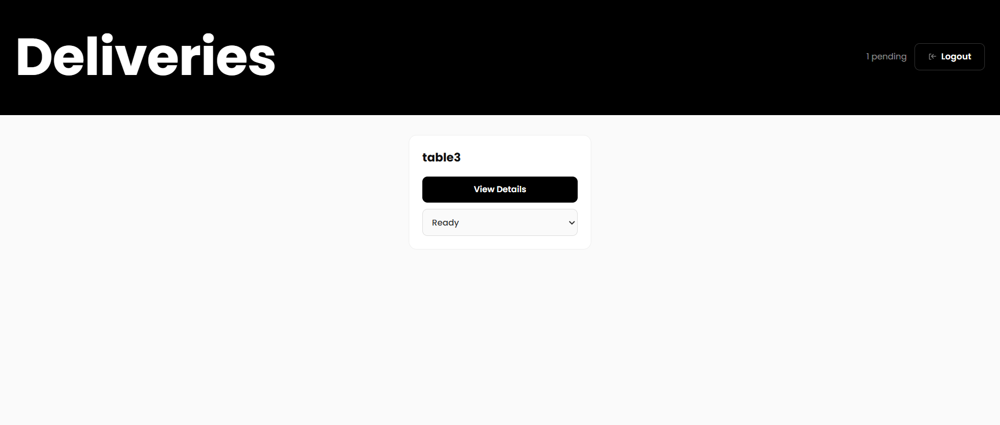 | 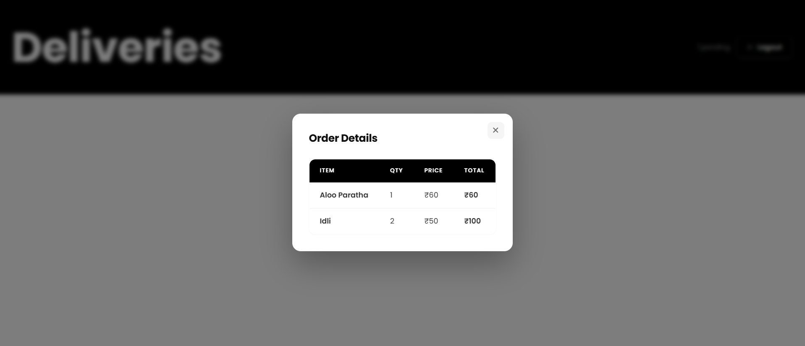 |

</details>

---

### 🛡️ Admin Panel

<details>
<summary><strong>📊 Dashboard & Analytics</strong></summary>
<br/>

| Dashboard — KPIs at a Glance | Today's Orders |
|:---:|:---:|
| 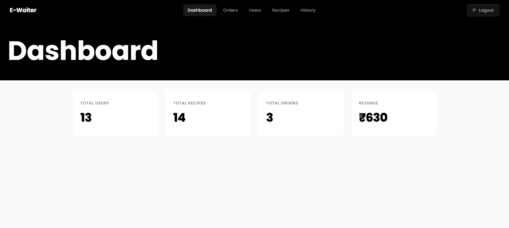 | 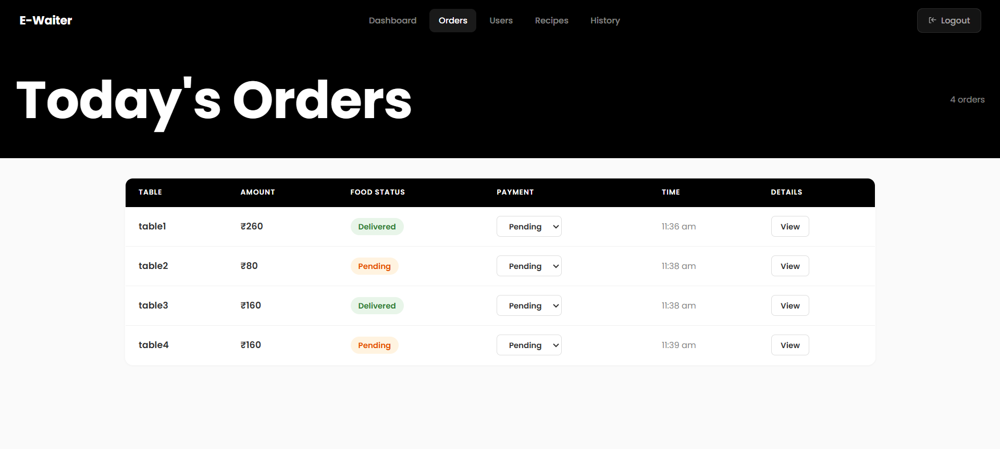 |

| Order Details Modal | Order History |
|:---:|:---:|
| 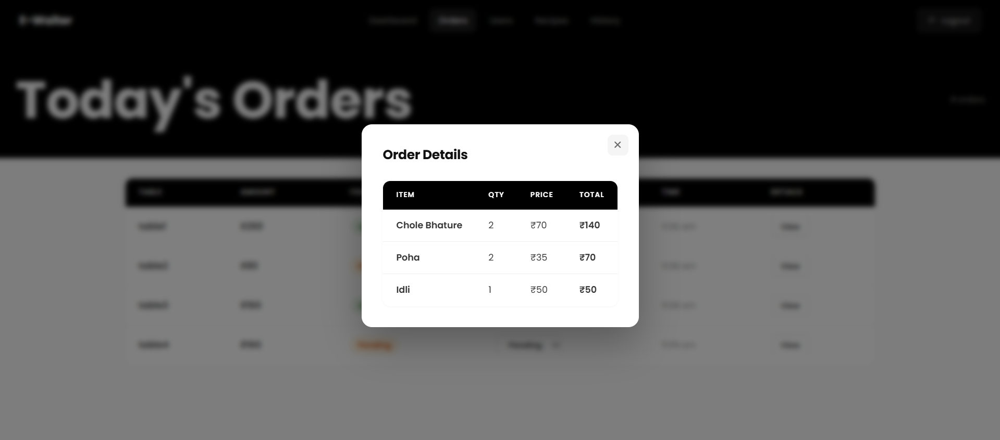 | 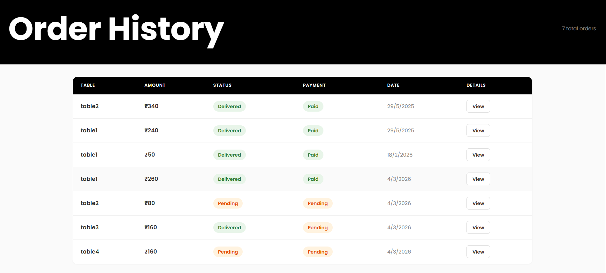 |

</details>

<details>
<summary><strong>🍕 Recipe & Table Management</strong></summary>
<br/>

| Recipe Listing | Add Recipe Modal |
|:---:|:---:|
| 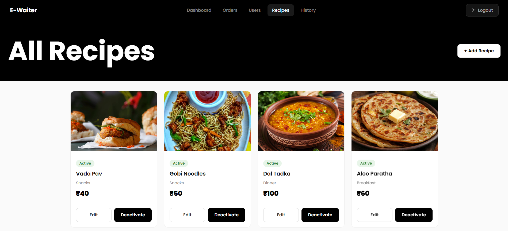 | 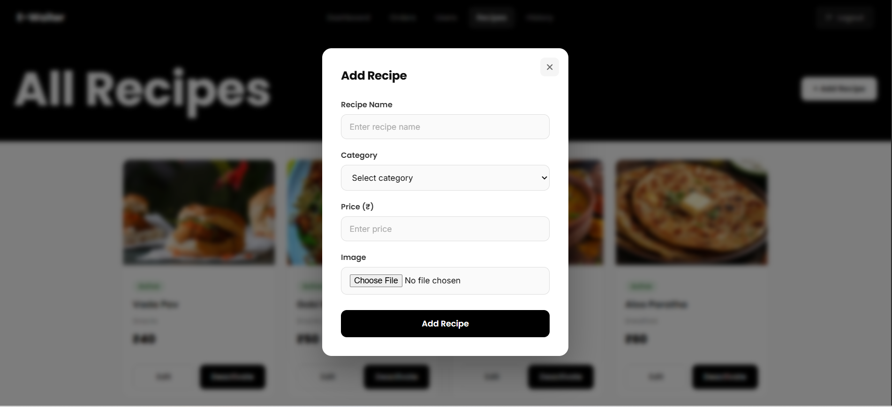 |

| Table Listing | Add Table Modal |
|:---:|:---:|
| 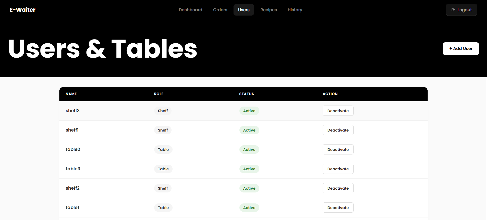 | 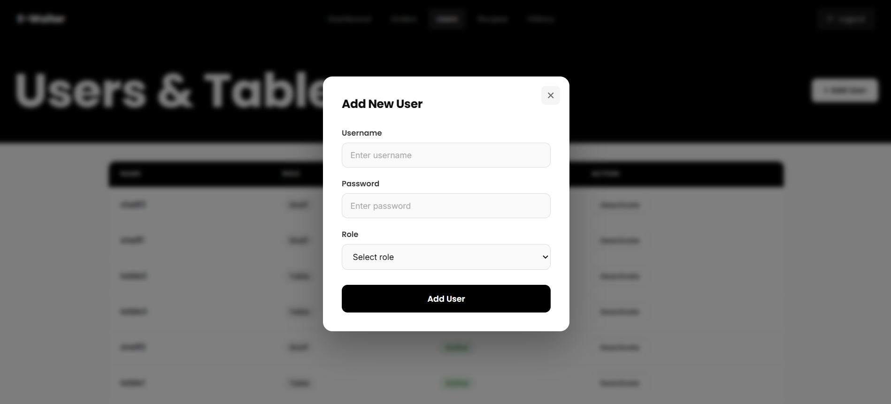 |

</details>

---

## ✨ Features

<table>
<tr>
<td width="25%" valign="top">

### 🪑 Customer
- Browse diverse menu with images
- Filter by **Breakfast**, **Lunch**, **Snacks**, **Dinner**
- Add items to cart with quantity controls
- Place orders — instantly notifies the kitchen

</td>
<td width="25%" valign="top">

### 👨‍🍳 Chef
- Live order tickets via Socket.IO
- View itemized order breakdowns
- Update status: `Pending` → `Processing` → `Processed`

</td>
<td width="25%" valign="top">

### 🍽️ Waiter
- Real-time alerts for ready orders
- View delivery details with item breakdown
- Mark orders as `Delivered`

</td>
<td width="25%" valign="top">

### 🛡️ Admin
- KPI dashboard — Users, Recipes, Orders, Revenue
- Full CRUD for recipes & tables
- Manage staff accounts
- Track orders & browse history

</td>
</tr>
</table>

### ⚡ Real-Time & Security
- **Socket.IO** WebSockets for instant cross-role communication
- **JWT-based authentication** with role-based protected routes
- **Appwrite** for secure image storage and management
- Passwords hashed with **bcrypt**

---

## 🏗️ Tech Stack

| Layer          | Technologies                                                          |
| -------------- | --------------------------------------------------------------------- |
| **Frontend**   | React 19, React Router 7, Axios, React Hot Toast, React Icons         |
| **Styling**    | Vanilla CSS with custom component-based theming                       |
| **Bundler**    | Vite 6                                                                |
| **Backend**    | Node.js, Express 5, Socket.IO                                        |
| **Database**   | MongoDB Atlas, Mongoose 8                                             |
| **Auth**       | JSON Web Tokens (JWT), bcrypt                                         |
| **Storage**    | Appwrite (image uploads & file management)                            |
| **HTTP**       | Axios (client), CORS (server)                                         |

---

##  Project Structure

```
E-Waiter/
├── client/                         # React frontend (Vite)
│   └── src/
│       ├── components/             # Reusable UI (Loader, Card, Cart, Modal)
│       ├── pages/
│       │   ├── admin/              # Dashboard, Tables, History, Orders, Recipes
│       │   ├── shef/               # Real-time kitchen ticket management
│       │   ├── waiter/             # Table & delivery management
│       │   └── user/               # Menu browsing & ordering interface
│       ├── Layouts/                # Auth-protected route wrappers
│       ├── Context/                # Global state (AuthContext, CartContext)
│       └── Api/                    # Modular Axios API helpers
│
├── server/                         # Express backend
│   └── src/
│       ├── controllers/            # Route handlers (auth, cart, food, order)
│       ├── models/                 # Mongoose schemas (Food, Order, User)
│       ├── router/                 # Express route definitions
│       ├── middleware/             # JWT auth middleware
│       └── utils/                  # Response helpers (ApiError, ApiSuccess)
│
└── screenshots/                    # Application screenshots
```

---

## 🚀 Getting Started

### Prerequisites

- **Node.js** ≥ 18
- **npm** ≥ 9
- **MongoDB** — local instance or [MongoDB Atlas](https://www.mongodb.com/atlas)
- **Appwrite** — [Cloud](https://cloud.appwrite.io) or self-hosted

### 1. Clone the Repository

```bash
git clone https://github.com/Manuacharya55/E-Waiter.git
cd E-Waiter
```

### 2. Setup the Server

```bash
cd server
npm install
```

Create a `.env` file inside the `server/` directory (refer to `.env.example`):

```env
MONGO_URL=your_mongodb_connection_string
JWT_SECRET=your_jwt_secret
SALT=10
```

Start the server:

```bash
npm run dev
```

### 3. Setup the Client

```bash
cd client
npm install
```

Create a `.env` file inside `client/` (refer to `.env.example`):

```env
VITE_PROJECT_END_POINT=https://cloud.appwrite.io/v1
VITE_PROJECT_ID=your_appwrite_project_id
VITE_BUCKET_ID=your_appwrite_bucket_id

VITE_API_URL=http://localhost:4000/api/v1
```

Start the client:

```bash
npm run dev
```

### 4. Open in Browser

Visit **[http://localhost:5173](http://localhost:5173)** to start using E-Waiter! 🎉

> **Note:** Make sure the backend server is running on port `4000` before starting the client.

---

## 🔄 Order Lifecycle

```
  🪑 Customer                👨‍🍳 Chef                  🍽️ Waiter               🛡️ Admin
  ──────────               ──────────               ───────────              ──────────
  Browse Menu               
  Add to Cart               
  Place Order ──────────►  Receives Order            
                           (Pending)                 
                           Start Cooking             
                           (Processing)              
                           Mark Complete             
                           (Processed) ──────────►   Receives Notification    Notified
                                                     Pick Up Order           at every
                                                     Deliver to Table        stage
                                                     Mark Delivered ──────►  
```

---

## 🧑‍💻 User Roles

| Role        | Icon | Access Level                                    |
| ----------- | ---- | ----------------------------------------------- |
| **Table**   | 🪑   | Browse menu, build cart, place orders            |
| **Chef**    | 👨‍🍳   | Receive & process orders in real-time            |
| **Waiter**  | 🍽️   | Deliver processed orders, update delivery status |
| **Admin**   | 🛡️   | Full control — users, recipes, tables, analytics |

---

## 🤝 Contributing

Contributions are welcome! Here's how you can help:

1. **Fork** the repository
2. **Create** a feature branch — `git checkout -b feature/amazing-feature`
3. **Commit** your changes — `git commit -m "Add amazing feature"`
4. **Push** to the branch — `git push origin feature/amazing-feature`
5. **Open** a Pull Request

> Please open an issue first to discuss major changes.

---

## 📄 License

This project is open source and available under the [MIT License](LICENSE).

---

<p align="center">
  Made with ❤️ by <a href="https://github.com/Manuacharya55"><strong>Manu</strong></a>
</p>
